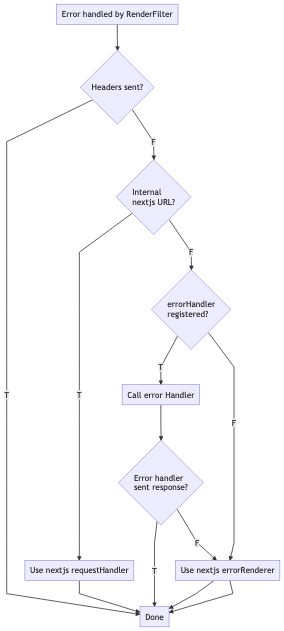

# NestJS NextJS Integration <!-- omit in toc -->

- [Installation](#installation)
- [Usage](#usage)
  - [Import and register the RenderModule](#import-and-register-the-rendermodule)
    - [Default views/pages folder](#default-viewspages-folder)
  - [Rendering Pages](#rendering-pages)
  - [Handling Errors](#handling-errors)
    - [Custom error handler](#custom-error-handler)
    - [Error Flow (Diagram)](#error-flow-diagram)
  - [Example folder structure](#example-folder-structure)
- [Configuring Next](#configuring-next)
- [By Example](#by-example)

## Installation

    yarn add nest-next

## Usage

### Import and register the RenderModule

In the `main.ts`, import Next and prepare it. Get the `RenderService` and register it by passing it the
Nest application and next server.

    const dev = process.env.NODE_ENV !== 'production';
    const app = Next({ dev });

    await app.prepare();

    const server = await NestFactory.create(AppModule);

    const renderer = server.get(RenderModule);
    renderer.register(server, app);

    await server.listen(process.env.PORT || 3000);

In the `application.module.ts` import the RenderModule.

    import { Module } from '@nestjs/common';
    import { RenderModule } from 'nest-next';

    @Module({
      imports: [
        RenderModule,
        ...
      ],
      ....
    })
    export class AppModule {}

#### Default views/pages folder

By default the the renderer will serve pages from the `/pages/views` dir. Due to limitations with
Next the `/pages` dir is not configurable, but the directory within the `/pages` dir is configurable.

The `register` method on the `RenderModule` takes an optional parameter `viewsDir` which determine the
folder inside of `pages` to render from. By default the value is `/views` but this can be changed or
set to null to render from the root of `pages`.

    interface RegisterOptions {
      viewsDir: null | string;
    }

### Rendering Pages

The `RenderModule` overrides the Express/Fastify render. To render a page in your controller import
the Render decorator from `@nestjs/common` and add it to the method that will render the page. The
path for the page is relative to the `/pages` directory.

    import {
      Controller,
      Get,
      Render,
    } from '@nestjs/common';

    @Controller()
    export class AppController {

      @Get()
      @Render('Index')
      public index() {
        // initial props
        return {
          title: 'Next with Nest',
        };
      }
    }

Additionally, the render function is made available on the res object.

    @Controller()
    export class AppController {

      @Get()
      public index(@Res() res) {
        res.render('Index', {
          title: 'Next with Nest',
        });
      }
    }

The render function takes in the view, as well as the initial props passed to the page.

    render = (view: string, initialProps?: any) => any

### Handling Errors

By default, errors will be handled and rendered with next's error renderer, which uses the ([customizable](https://nextjs.org/docs/#custom-error-handling)) \_error page. Additionally, errors can be intercepted by setting your own error handler.

#### Custom error handler

A custom error handler can be set to override or enhance the default behavior. This can be used for things such as logging the error or rendering a different response.

In your custom error handler you have the option of just intercepting and inspecting the error, or sending your own response. If a response is sent from the error handler, the request is considered done and the error won't be forwarded to next's error renderer. If a response is not sent in the error handler, after the handler returns the error is forwarded to the error renderer. See the request flow below for visual explanation.

**ErrorHandler Typedef**

```typescript
export type ErrorHandler = (
  err: any,
  req: any,
  res: any,
  pathname: any,
  query: ParsedUrlQuery,
) => Promise<any>;
```

**Setting ErrorHandler**

You can set the error handler by getting the RenderService from nest's container.

```typescript
// in main.ts file after registering the RenderModule

const main() => {
  ...

  const renderer = server.get(RenderModule);
  renderer.register(server, app);

  // get the RenderService
  const service = server.get(RenderService);

  service.setErrorHandler(async (err, req, res) => {
    // send JSON response
    res.send(err.response);
  });

  ...
}

```

#### Error Flow (Diagram)

_The image is linked to a larger version_

[](./docs/out/error-filter-sequence.png)

### Example folder structure

Next renders pages from the pages directory. The Nest source code can remain in the default `/src` folder

    /src
      /main.ts
      /app.module.ts
      /app.controller.ts
    /pages
      /views
        /Index.jsx
    /components
      ...
    next.config.js
    .babelrc
    .babelrc-server

## Configuring Next

**Required Dependencies**

- `@zeit/next-typescript`

**Next Config**

To enable typescript and custom server support with Next the `next.config.js` file must be modified.

    const withTypescript = require('@zeit/next-typescript');

    module.exports = withTypescript({
      useFileSystemPublicRoutes: false,
    });

**Babel**

The .babelrc file must be edited as well.

    {
      "presets": ["next/babel", "@zeit/next-typescript/babel"],
      "plugins": [
        [
          "@babel/plugin-proposal-decorators",
          {
            "legacy": true
          }
        ],
      ],
    }

## By Example

A fully setup project with some additional things (.env, caching) can be viewed in
the [example folder](/example)
